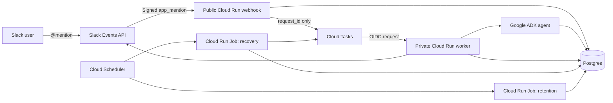

# Asynchronous Slack HR Policy Assistant

**Status:** Approved
**Owner:** AI Architect course team
**Decision date:** 2026-08-14

## Summary

The finished course application is an asynchronous Slack HR policy assistant.
An employee mentions the assistant in the configured HR channel and receives either a cited policy answer or a human-review message in the same thread.

The public webhook verifies Slack, stores the request in Postgres, creates a Cloud Task, and acknowledges the event within 2.5 seconds under normal conditions.
The webhook never calls a model or retrieves a policy document.

A private Cloud Run worker claims the stored request and runs the slow policy workflow.
The Google ADK agent uses constrained Postgres tools, and deterministic application code validates evidence, records the decision, and controls the Slack reply.
The finished application uses Google ADK with Gemini through Google Cloud Agent Platform.
`gemini-3.5-flash` is the current tested default and remains configurable.

Postgres is the source of truth for policy documents, support requests, fenced claims, decisions, task generations, and outbound actions.
Cloud Tasks delivers one internal request ID to one worker handler.
Slack is the employee interface.

## Scope

Version 1 supports one configured Slack workspace, one public HR channel, and one assistant.
An employee invokes the assistant with an `app_mention` in that channel.
Every mention is an independent support request, including mentions added to an existing Slack thread.

The bot replies in the originating thread.
It does not load other thread messages as conversation memory.

The assistant answers general HR questions covered by approved company policies.
It does not access employee records, calculate personal entitlements, approve requests, make employment decisions, process files, or answer from untrusted sources.

## Goals

- Answer common questions from trusted policy documents.
- Make the source of every supported answer visible and verifiable.
- Give unsupported, sensitive, personal, or conflicting questions a fixed reply that asks the employee to contact HR without tagging a Slack user or user group.
- Acknowledge Slack before model latency can exceed the webhook deadline.
- Survive duplicate delivery, process crashes, and temporary provider failures.
- Prevent stale workers and retries from creating duplicate known replies.
- Keep every important state transition inspectable and teachable.
- Run the core policy workflow locally without Slack or Google Cloud.

## Non-goals

- Multiple Slack workspaces or a Slack OAuth installation lifecycle.
- Direct messages or listening to every channel message.
- Multi-turn conversation memory.
- File, image, audio, or attachment processing.
- Private employee-data lookup.
- Leave approval, expense approval, pay calculation, record changes, or employment decisions.
- A custom support dashboard.
- Automatic resend after an uncertain Slack delivery.
- Vector search in the finished version 1 workflow.
- Arbitrary model-generated SQL.

## System Context



The webhook and worker are separate Cloud Run services from one Python codebase and application image.
Recovery and retention are finite Cloud Run Jobs from the same image.
Cloud Scheduler starts the jobs with a maintenance service identity.

## Responsibilities

| Component | Owns | Does not own |
|---|---|---|
| Slack webhook | Raw-body signature verification, timestamp checks, team allowlist, event filtering, durable acceptance, initial task creation | Retrieval, model calls, support decisions, or replies |
| Postgres | Requests, claims, task generations, policies, decisions, attempts, outbound actions, and audit state | Task delivery or worker compute |
| Cloud Tasks | Authenticated delivery, retry timing, concurrency, and rate limits | Business status, claim ownership, or AI decisions |
| Policy worker | Claims, deadlines, workflow execution, failure classification, evidence validation, and controlled Slack actions | Webhook authentication or arbitrary queue routing |
| Policy agent | Document selection and a typed answer or human-review decision | Arbitrary SQL, Slack calls, queues, or database writes |
| Slack adapter | Posting one prepared thread reply and returning the Slack message timestamp | Deciding whether an answer is supported or safe |
| Recovery job | Repairing safely stranded work and surfacing exhausted or uncertain work | Model calls, policy decisions, or automatic resend of uncertain actions |
| Retention job | Clearing expired sensitive fields in bounded batches | Deleting the workflow audit trail or policy documents |

## Required Invariants

- `INV-1`: One Slack `event_id` creates at most one support request.
- `INV-2`: The webhook never calls the model or performs document retrieval.
- `INV-3`: A Cloud Task contains only an internal `request_id`.
- `INV-4`: Only the current fenced claim may run or mutate the policy workflow.
- `INV-5`: The agent may answer only after loading at least one active policy document.
- `INV-6`: The agent cannot execute arbitrary SQL or send Slack messages.
- `INV-7`: One support request creates at most one known successful Slack reply.
- `INV-8`: A `human_review` decision never contains an automated policy answer.
- `INV-9`: Complete Slack message text never appears in logs or task payloads.

Every implementation and test must preserve these identifiers and meanings.

## Service Requirements

- The webhook returns a `2xx` response within 2.5 seconds under normal conditions.
- The worker targets a 60-second response time and stops application work before a five-minute Cloud Run request timeout.
- The initial Cloud Tasks queue permits ten concurrent tasks and five dispatches per second.
- Each task generation has at most five platform delivery attempts with exponential backoff.
- A support request may begin at most five business attempts across all task generations.
- The worker starts with concurrency `1` per instance and at most ten instances.
- Each worker database pool uses at most five connections.
- Each agent run uses at most six model turns and loads at most three complete policy documents.
- Stored question text and Slack user IDs expire after 30 days.
- Policy documents remain until an operator deactivates or deletes them.

## Slack Webhook Interface

`POST /slack/events` accepts Slack URL verification and event callbacks.
For every callback, the webhook verifies the HMAC signature from the raw request body before parsing JSON.
It rejects unsigned requests, timestamps older than five minutes, bot-authored events, missing identifiers, and unsupported event shapes.

The configured `SLACK_ALLOWED_TEAM_IDS` allowlist contains exactly one team in version 1.
The configured `SLACK_ALLOWED_CHANNEL_IDS` allowlist contains exactly one public HR channel.
An otherwise valid event whose `team_id` or `channel_id` is not allowed fails closed and creates no request or task.
The allowlist is checked in addition to the Slack signature because a validly signed event can still belong to the wrong installation.

Unsupported event types receive `2xx` without creating work so Slack does not retry events the app intentionally ignores.
A valid `app_mention` is normalized to:

```json
{
  "slack_event_id": "Ev_example",
  "slack_team_id": "T_example",
  "slack_channel_id": "C_example",
  "slack_message_ts": "1700000000.000100",
  "slack_thread_ts": "1700000000.000100",
  "slack_user_id": "U_example",
  "question_text": "[sanitized HR policy question]"
}
```

If the mention is already in a thread, `slack_thread_ts` is the root thread timestamp.
Otherwise, the event message timestamp becomes the thread timestamp.
The bot mention is removed from `question_text` before storage.

The complete raw Slack payload is not stored.
The normalized question is stored only in Postgres for retry stability and is marked for expiry.

## Durable Acceptance and Task Creation

The webhook inserts the support request before creating a Cloud Task.
Postgres enforces a unique constraint on `slack_event_id`.
A Slack retry returns the existing request instead of creating another row.

Task generation starts at `1`.
The task name is a stable SHA-256 digest of the Slack event ID and task generation.
A webhook retry therefore attempts the same initial task name.

If task creation fails, the webhook leaves the request in `accepted` and returns a non-`2xx` response so Slack can retry safely.
If Cloud Tasks reports that the deterministic name already exists, the webhook records the request as `queued`.

The Cloud Task calls `POST /tasks/process-support-request` with:

```json
{
  "request_id": "01900000-0000-7000-8000-000000000000"
}
```

No question, Slack payload, user ID, policy text, or credential appears in the task body.
Cloud Tasks attaches an OIDC token for the private worker service.
Cloud Run IAM and worker-side identity checks require the expected audience and task service account.

## Postgres Data Contract

### `support_documents`

```text
id, source_file, title, category, summary, keywords, body,
content_hash, revision, is_active, created_at, updated_at
```

`source_file` is the readable policy filename shown in a supported Slack answer.
`content_hash` or `revision` identifies the exact document version used by the decision.

### `support_requests`

```text
request_id, slack_event_id, slack_team_id, slack_channel_id,
slack_message_ts, slack_thread_ts, slack_user_id, question_text,
content_expires_at, status, task_generation, confirmed_task_name,
business_attempt_count, last_error_category, created_at, queued_at,
processing_at, completed_at, failed_at
```

Request status is `accepted`, `queued`, `processing`, `completed`, `failed`, or `reconciliation`.
Task delivery count is not used directly as the business attempt count.
The repository maintains `business_attempt_count` from auditable `support_attempts` rows.
No worker or recovery task may start a sixth business attempt.

### `support_request_claims`

```text
request_id, claim_token, lease_version, lease_expires_at,
business_attempt_number, claimed_at, released_at
```

Each successful claim receives a unique token and an increasing lease version.
Every processing transition, decision write, outbound-action creation, action send transition, and terminal write compares the current claim token and lease version.
A worker whose lease expires cannot write a result or create or send an action after another worker obtains the next version.

### `support_attempts`

```text
attempt_id, request_id, task_generation, claim_token, attempt_kind,
outcome, started_at, completed_at
```

Attempt kind is `workflow` or `delivery_exhausted`.
A worker atomically records one workflow attempt when it obtains a current claim and begins the policy workflow.
If a task generation exhausts or disappears before any worker claim reaches application code, recovery atomically records one delivery-exhausted attempt for that generation.
Unique constraints prevent the same claim token or exhausted task generation from being counted twice.
Authentication rejection, duplicate-complete delivery, and active-lease delivery do not consume a business attempt.

### `support_decisions`

```text
decision_id, request_id, claim_token, decision, reason_code, answer, reason,
sources, created_at
```

Decision is `answer` or `human_review`.
Human-review reason code is `off_topic`, `unsupported`, `sensitive`, `conflict`, or `invalid_evidence`.
Sources store the document ID, source filename, supporting excerpt, and document revision or hash used for verification.

### `agent_runs`

```text
agent_run_id, request_id, claim_token, model_id, input_tokens,
retrieved_context_tokens, output_tokens, duration_ms, finish_reason,
tool_call_count, model_turn_count, created_at
```

Agent-run records contain operating metadata and no employee question, answer, policy body, or supporting excerpt.
Retries create separate run records so total request cost and latency can be reconstructed.

### `outbound_actions`

```text
action_id, request_id, action_generation, claim_token, action_type,
status, outbound_text, content_hash, slack_message_ts, last_error_category,
started_at, created_at, completed_at
```

Outbound status is `pending`, `sending`, `succeeded`, `failed`, `uncertain`, or `cancelled`.
The exact planned Slack text and its content hash are stored in the transaction that creates the action.
The database permits at most one non-cancelled reply action per `request_id` across every task and action generation.
Task generation never changes this uniqueness boundary.
Only an explicit audited operator decision can cancel an uncertain action before creating a controlled later `action_generation`.

## Claim and Worker Lifecycle

One task follows this worker sequence:

```text
authenticate task identity
-> load request_id
-> atomically claim retryable work
-> load the stored question and Slack identifiers
-> run the constrained policy agent within a deadline budget
-> verify the typed decision and sources
-> persist the decision under the current claim
-> build and persist one exact outbound action under the current claim
-> move the action to sending under the current claim
-> call Slack
-> record Slack message timestamp
-> complete the action and request under the current claim
```

A task for a completed request returns success without another model call.
A task that finds an active lease returns the retryable status required by the task policy.
An expired lease permits a new claim with a larger lease version.

The lease extends beyond the hard workflow deadline, or the implementation renews it safely.
Every database and network operation receives the remaining deadline budget.
The worker stops starting new work before Cloud Run can terminate the request.

## Policy Agent and Retrieval

The policy agent has two read-only tools:

```text
list_support_documents() -> active document index
get_support_document(document_id) -> complete active document
```

The tool implementations use fixed parameterized SQL.
The agent cannot issue arbitrary SQL, mutate policy state, create tasks, or post to Slack.

The agent may load at most three complete active documents and run for at most six turns.
It returns a typed decision:

```json
{
  "decision": "answer",
  "answer": "[concise grounded answer]",
  "reason": "The active annual leave policy directly supports the answer.",
  "sources": [
    {
      "document_id": "annual-leave-policy",
      "source_file": "annual-leave-policy.md",
      "supporting_excerpt": "[short excerpt copied from the loaded policy]",
      "document_revision": "sha256:example"
    }
  ]
}
```

An `answer` requires a non-empty answer and at least one source.
Application code verifies that every document was loaded and active, every source file matches the registry, every revision matches the loaded version, and every supporting excerpt occurs exactly in that document.
The excerpt must support a material claim in the answer.

The typed `human_review` decision requires `answer` to be null, `sources` to be empty, and `reason_code` to be set.
The agent chooses human review when the request is off topic, no active document supports it, it is sensitive or requires private data or an action, evidence is insufficient, or relevant documents conflict.
Application validation converts an invalid or unverifiable answer to human review or a safe failure and never sends the unsupported answer.

## Slack Reply Behavior

The model never sends Slack messages.
Application code formats the validated decision and performs the external action.

A supported reply contains:

- the concise policy answer
- a `Sources` section
- each verified readable policy filename

The full verified excerpts and document revisions remain in the persisted decision for inspection.
The Slack reply may omit the excerpts when the filename is enough for a readable employee response.

A no-answer reply is a fixed application template selected by `reason_code`.
An `off_topic` result states that the assistant answers only HR policy questions and does not notify HR.
Every other human-review result replies exactly: “I couldn’t find a reliable answer in the policy documents. Please ask a member of the HR team.”
The reply does not tag a Slack user or user group and requires no support-group configuration.
No no-answer template contains a model-generated policy answer.

Both outcomes reply to `slack_thread_ts` in the original channel.

## Outbound Action Safety

The worker persists the exact outbound message before calling Slack.
It changes the action from `pending` to `sending` only while its claim remains current.
A stale claim cannot create, start, or complete an outbound action.

A known successful Slack call returns a message timestamp.
The worker records that timestamp before marking the action and request complete.
A retry sees the succeeded action and does not send again.

A clear failure before a request reaches Slack is retryable according to its failure class.
A clear Slack rejection can be retryable or permanent based on the response code.

A timeout, connection loss, or process failure after sending begins has an uncertain result.
The worker marks the action `uncertain`, moves the request to `reconciliation`, and returns success to stop automatic task delivery.
The system never automatically resends a pending action from an expired claim or an uncertain action.

An authenticated operator command inspects reconciliation records without printing message text or excerpts.
The operator records one audited outcome: `confirmed_sent`, `confirmed_not_sent_and_retry`, or `cancelled`.
`confirmed_not_sent_and_retry` first cancels the earlier uncertain action, records the audit event, and only then creates a new controlled action generation.

## Failure Classification

Retryable failures include temporary database errors, model-provider errors, worker timeouts before an external send, rate limits, and clear pre-send Slack transport failures.
Permanent failures include invalid request state, missing policy configuration, revoked credentials, forbidden team configuration, and invalid typed decisions that cannot be converted safely.

The application records safe error categories, not full request, answer, excerpt, token, or payload content.
After five business attempts are exhausted, the request becomes `failed` and emits an operator-visible signal.

Cloud Tasks may exhaust platform delivery attempts before application code records a business failure.
Scheduled recovery is therefore required and does not infer safety from queue state alone.

## Recovery Job

Cloud Scheduler runs the finite recovery Cloud Run Job every five minutes.
The job scans bounded batches of stale `accepted`, stale `queued`, expired `processing`, and stale `pending`, `sending`, or `uncertain` outbound records.

Recovery follows these rules:

- A stale accepted request without a confirmed task receives its deterministic current task generation.
- A queued request whose task disappeared receives a new deterministic task generation only when no active task or claim can still process it safely.
- A task generation that exhausted before any claim reached application code records one `delivery_exhausted` business attempt before recovery decides whether another generation is allowed.
- Expired processing work becomes reclaimable through a newer fenced claim.
- A request with five business attempts receives no new task generation, becomes `failed`, and emits an operator-visible signal.
- A stale pending or sending action from an expired claim becomes `uncertain` and the request enters reconciliation.
- An uncertain action is surfaced to the operator and is never automatically resent.
- Re-running recovery creates no duplicate request, active task generation, or sendable action.

Recovery increments `task_generation` only after it proves the earlier generation is no longer active and a resend is safe.
This distinguishes a Slack retry of the same event from deliberate repair of stranded internal work.

## Retention Job

Cloud Scheduler runs the finite retention Cloud Run Job once per day.
The job clears `question_text` and `slack_user_id` after `content_expires_at`, 30 days after acceptance by default.
It processes bounded batches and is safe to run repeatedly.

Retention preserves:

- request ID and Slack event ID
- team, channel, message, and thread identifiers required for audit
- status and task generation
- decision class
- policy source IDs, filenames, revisions, and hashes
- model ID, token counts, duration, finish reason, and tool-call count
- outbound content hashes and Slack result identifiers
- timestamps, durations, attempts, and safe error categories

Logs never print the fields being cleared.
Production Slack messages are never copied into eval fixtures.

## Identity and Permissions

The public webhook accepts unauthenticated network traffic because Slack must reach it, but every Slack event must pass signature, age, and team checks.
Its service account can insert requests and create Cloud Tasks.
It cannot call the model or send Slack messages.

The worker is private.
Only the expected Cloud Tasks service account has the Cloud Run Invoker role.
The worker service account can read and update application tables, invoke Gemini through Google Cloud, and send Slack messages.
It receives the minimum Google Cloud model-invocation role required by the configured provider.

Cloud Scheduler can start the recovery and retention jobs through the maintenance service account.
The maintenance runtime can update request state and create recovery tasks.
It cannot call the model or send Slack messages.

Cloud Tasks cannot start maintenance jobs.
The maintenance identity cannot invoke the worker.
The worker identity cannot start maintenance jobs.

Slack signing secrets, bot tokens, and database credentials live in Secret Manager.
The application does not use or store a separate Gemini API key.
Local authenticated integration uses Application Default Credentials.
Cloud Run uses the worker runtime service identity.
No course documentation, issue, log, task payload, test fixture, or `MEMORY.md` contains their values.

## Model Configuration

Google ADK runs Gemini through Google Cloud Agent Platform for the finished application.
The model setting defaults to `gemini-3.5-flash` and remains configurable.
`GOOGLE_CLOUD_PROJECT` and `GOOGLE_CLOUD_LOCATION` provide the project and location.

Gemini Flash is primary because model selection is an architecture and operating-cost decision.
The selection rule is the smallest model that passes the HR support evals, not model prestige.
Relevant cost drivers are input tokens, retrieved context size, output tokens, tool and model turns, retries, latency, and escalation rate.

The application records model ID, input and output tokens, duration, finish reason, and tool-call count for each run.
It also records retrieved-context tokens and model-turn count when the provider exposes them or the application can calculate them safely.
These records never contain employee or policy text.

Evals use a dated price configuration to estimate cost per request and per resolved automated answer.
Long-lived architecture and teaching prose does not contain current price figures.

Deterministic local tests inject a fake model and do not require network access or credentials.
An optional local integration run uses Application Default Credentials configured outside the repository.
The development and production Cloud Run workers use their runtime service identities instead of API-key secrets.

## Development and Deployment Progression

Students can run the policy agent, state machine, and worker without Slack, Cloud Tasks, Cloud Run, or a live model.
The worker is an HTTP handler that accepts only `request_id` and loads durable input from Postgres.

```text
Policy unit test
-> pass a synthetic question to fake policy tools and a fake model

State-machine test
-> use Postgres to claim, expire, reclaim, and reject a stale worker

Direct worker test
-> call the HTTP handler locally with request_id and no webhook

Local asynchronous test
-> enqueue request_id through an explicit local adapter to a separate worker process

Development deployment
-> deploy the private worker to a development Cloud Run service
-> invoke it through gcloud run services proxy or another authenticated request

Queue integration
-> configure Cloud Tasks OIDC to invoke the same private worker handler

Slack ingress
-> connect the public webhook only after direct worker and queue delivery pass
-> use a temporary HTTPS tunnel when real Slack must reach a local webhook
```

Google Cloud does not provide a supported Cloud Tasks emulator.
The course does not add a third-party emulator.
The explicit local queue adapter is a teaching seam and does not change the production architecture.

The private development worker is an early deployment checkpoint.
The later production hardening lesson adds final IAM, recovery, retention, observability, concurrency proof, and operational checks.

Synthetic fixtures use invented content and placeholder Slack identifiers.
Tunnel URLs, service URLs, Slack credentials, and complete messages are not recorded in docs, logs, or `MEMORY.md`.

## Observability

Operators need metrics for:

- webhook latency and rejected authentication
- accepted requests without confirmed tasks
- queue depth and task dispatch attempts
- business attempt count
- active and expired claims
- processing latency
- answer and human-review rates
- failed and reconciliation requests
- expired sensitive fields
- model usage and estimated cost
- input, retrieved-context, and output tokens
- tool calls and model turns
- model duration and finish reasons
- estimated cost per request and per resolved answer from the selected dated price configuration

Logs and traces use request IDs, state names, timings, counts, hashes, and safe error categories.
They never contain complete questions, answers, policy bodies, supporting excerpts, Slack payloads, or credentials.
Every production ADK run explicitly disables message-content capture in its telemetry configuration.

## Acceptance Criteria

- `AC-1`: A valid Slack mention is stored once, queued once initially, acknowledged within 2.5 seconds, and receives one thread reply.
- `AC-2`: Replaying the same Slack event does not create another request, initial task, completed model run, or known successful reply.
- `AC-3`: A documented HR policy question produces an answer whose verified sources name the policy file, revision, and supporting excerpt loaded by the agent.
- `AC-4`: An unsupported, sensitive, or conflicting question produces `human_review` with no automated policy answer and replies, “I couldn’t find a reliable answer in the policy documents. Please ask a member of the HR team.” without tagging a Slack user or user group.
- `AC-5`: A model, database, or safe pre-send failure is retried without losing the support request, and retry exhaustion becomes visible to recovery or an operator.
- `AC-6`: A worker crash becomes retryable after its lease expires, while its stale token or version cannot write a result or send a reply.
- `AC-7`: A task cannot invoke the worker without the expected Google Cloud identity.
- `AC-8`: Logs and Cloud Task payloads do not contain complete Slack question text.
- `AC-9`: The policy workflow and worker run locally against a synthetic fixture without Slack, Cloud Tasks, or Cloud Run.
- `AC-10`: The deployed system processes ten independent requests concurrently without exceeding the configured worker limit.
- `AC-11`: The retention job removes question text and Slack user IDs after 30 days while preserving the documented audit fields.
- `AC-12`: Only the expected Cloud Scheduler identity can start maintenance jobs, and that identity cannot invoke the support worker.

## Test Approach

Unit tests prove normalization, signature verification, team allowlisting, task naming, state transitions, fenced claims, tool limits, typed output validation, exact excerpt verification, conflict handling, and log redaction.
They cover `INV-1` through `INV-9` without real Slack or Google Cloud calls.

Workflow tests run synthetic questions against fake document tools.
They prove `AC-3`, `AC-4`, and `AC-9` while keeping retrieval, decision, evidence, and formatting visible.

Postgres integration tests replay events, race claims, expire leases, leave stale outbound actions, run retention, inject retryable failures, and prove `AC-1`, `AC-2`, `AC-5`, `AC-6`, `AC-8`, and `AC-11`.

Google Cloud smoke tests verify the worker and maintenance identities for `AC-7` and `AC-12` with missing, swapped, and correct identities.
A dedicated test workspace and synthetic channel are used.

A deployed load test submits ten independent signed fixtures together.
A fake agent waits at a database-backed barrier until at least two workers hold current claims, then releases them.
The test asserts ten completions, no duplicate known replies, overlapping processing intervals, and a peak active worker count greater than one and no greater than ten for `AC-10`.

## Implementation Order

1. Lock the design, split it into linked tasks, and create the sanitized `MEMORY.md` log.
2. Build the local policy agent and Postgres knowledge base with typed decisions and verified source citations.
3. Add Postgres request state, fenced claims, decisions, and outbound actions.
4. Build and call the `request_id` worker HTTP handler locally without a webhook.
5. Add the explicit local queue adapter and run a separate worker process.
6. Deploy the private worker to a development Cloud Run service and invoke it manually through the supported proxy or an authenticated request.
7. Add Cloud Tasks and prove OIDC invokes the same worker.
8. Connect the public Slack webhook as the task producer and perform a sanitized real-Slack check.
9. Add cited formatting, the fixed human-review fallback, deadlines, reconciliation, scheduled jobs, evals, observability, and production hardening.

## Open Questions

- Confirm whether 30-day question retention is appropriate before using real employee data.
- Decide whether a later version should re-fetch an edited or deleted Slack message before replying.
- Decide whether human review should also post to a private HR channel in a later version.
