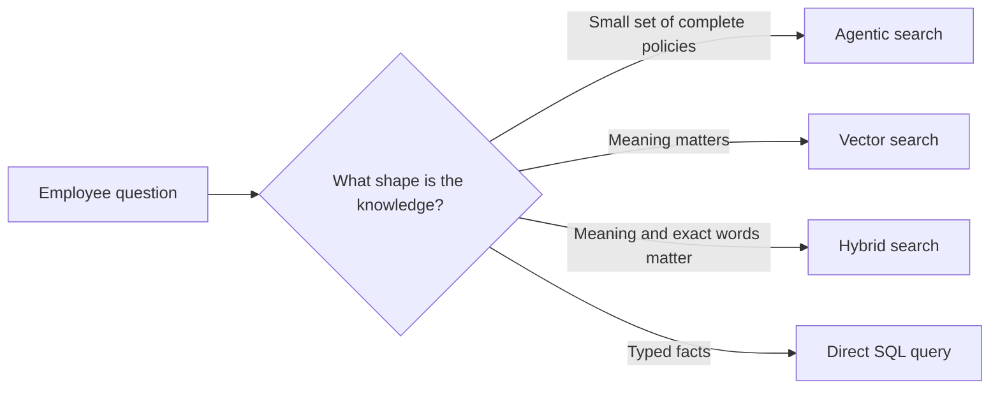
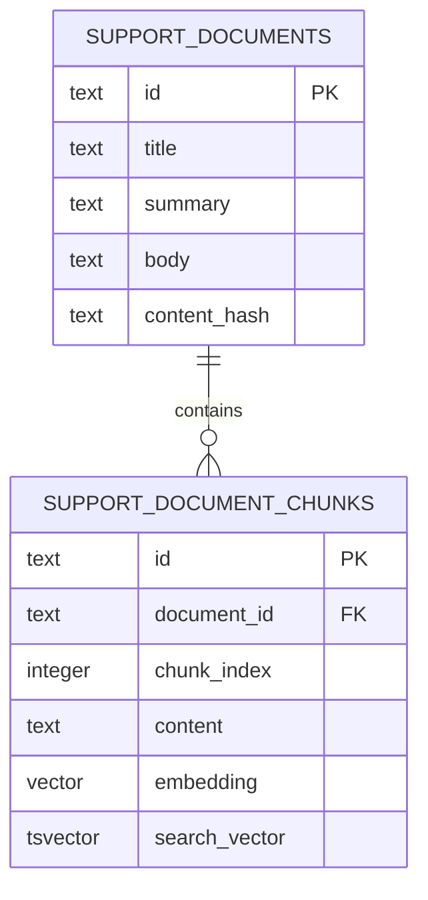

# RAG implementation guides

Lesson 05 compares three useful retrieval strategies against the same HR policy data.
The examples share one local PostgreSQL database so the retrieval method is the variable, not the infrastructure.

## Choose a strategy

| Strategy | Retrieve | Best fit | Main tradeoff |
|---|---|---|---|
| [Agentic search](agentic-search.md) | A complete document chosen from titles and summaries | A small, curated policy set | More model decisions, but no chunk ranking |
| [Vector search](vector-search.md) | Semantically similar chunks | Questions and documents use different words | Exact identifiers and rare terms can rank poorly |
| [Hybrid search](hybrid-search.md) | Chunks found by both semantic and keyword search | General-purpose search over mixed content | More moving parts to tune and observe |

Structured SQL retrieval is also a form of retrieval-augmented generation.
It is a good fit when the answer already lives in typed rows and columns, such as an order status or account balance.
It is mentioned in the lesson, but it is not a fourth demo because the course problem is document retrieval.

## Run the sequence

Start with [PostgreSQL and pgvector setup](postgres-and-pgvector.md).
It creates these shared tables:

Then run the examples in this order:

1. [Agentic search](agentic-search.md)
2. [Vector search](vector-search.md)
3. [Hybrid search](hybrid-search.md)

The production Slack assistant intentionally uses the first approach.
The vector and hybrid examples teach common retrieval techniques without making them production requirements.
