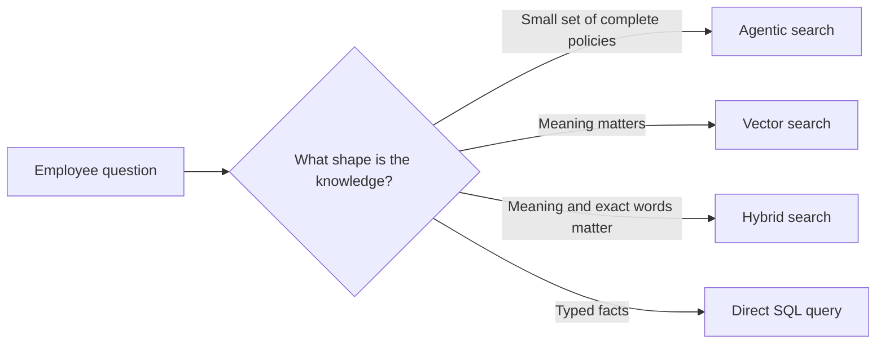
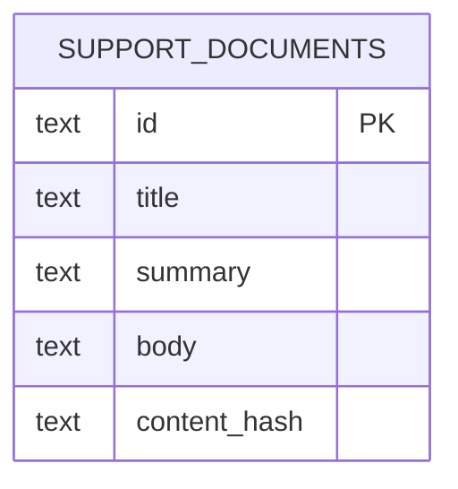
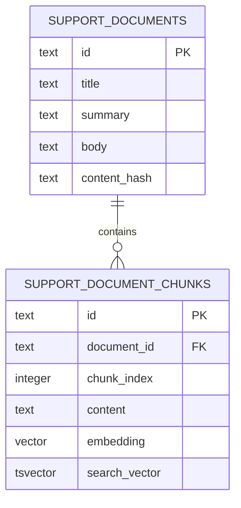

# RAG implementation guides

The course separates the production retrieval choice from two optional alternatives.

- Lesson 05 uses [agentic search](agentic-search.md) over complete documents in PostgreSQL.
- Lesson 06 covers [vector search](vector-search.md) and [hybrid search](hybrid-search.md) as standalone alternatives.

## Choose a strategy

| Strategy | Retrieve | Best fit | Main tradeoff |
|---|---|---|---|
| [Agentic search](agentic-search.md) | A complete document chosen from titles and summaries | A small, curated policy set | More model decisions, but no chunk ranking |
| [Vector search](vector-search.md) | Semantically similar chunks | Questions and documents use different words | Exact identifiers and rare terms can rank poorly |
| [Hybrid search](hybrid-search.md) | Chunks found by both semantic and keyword search | General-purpose search over mixed content | More moving parts to tune and observe |

Structured SQL retrieval is also a form of retrieval-augmented generation.
It is a good fit when the answer already lives in typed rows and columns, such as an order status or account balance.
It is mentioned in the lesson, but it is not a fourth demo because the course problem is document retrieval.

## Run Lesson 05

Start with the [PostgreSQL document store setup](postgres-document-store.md).
It creates one authoritative table:

Then run the [agentic search example](agentic-search.md) from the command line or in ADK Web.
This is the approach used by the production Slack assistant.

## Run Lesson 06

Start with the [PostgreSQL and pgvector setup](postgres-and-pgvector.md).
Lesson 06 creates a separate schema in the shared local `rag_lesson` database:

Then run [vector search](vector-search.md) followed by [hybrid search](hybrid-search.md).
The hybrid-search guide also shows how to inspect the final retrieval tool in ADK Web.
Later course lessons do not depend on Lesson 06.
