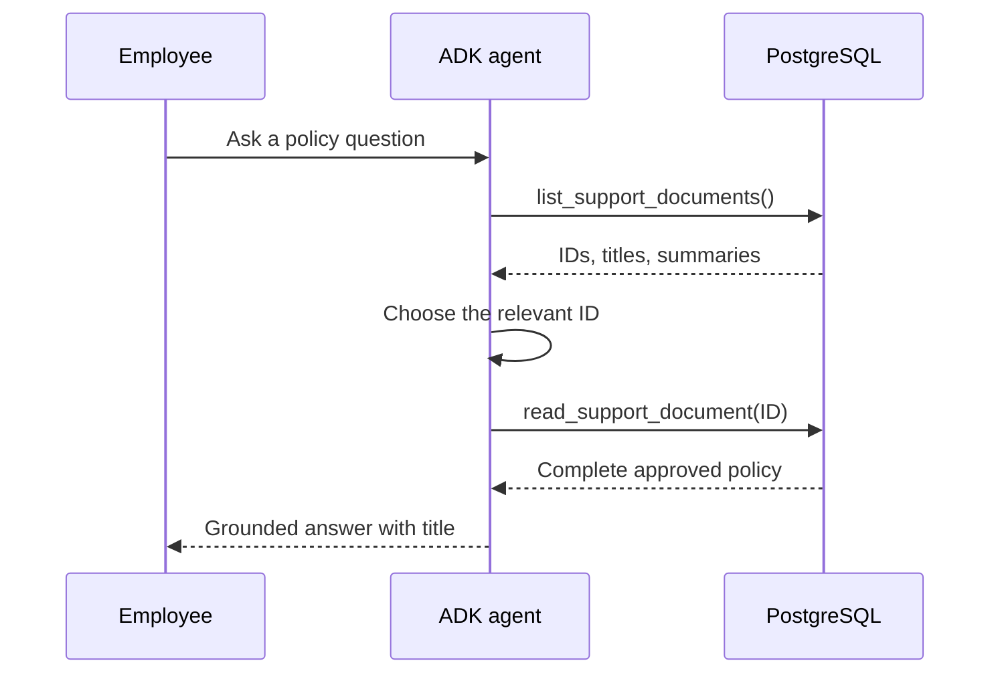

# Agentic search over complete documents

Agentic search lets the model decide how to retrieve information through tools.
In this example the agent first sees a small index of titles and summaries, then loads one complete policy by ID.

## The retrieval path


```mermaid
sequenceDiagram
    participant U as Employee
    participant A as ADK agent
    participant D as PostgreSQL
    U->>A: Ask a policy question
    A->>D: list_support_documents()
    D-->>A: IDs, titles, summaries
    A->>A: Choose the relevant ID
    A->>D: read_support_document(ID)
    D-->>A: Complete approved policy
    A-->>U: Grounded answer with title
```

The list tool is a small catalogue.
The read tool is the authority boundary because it accepts only an exact document ID from the database.
The model never invents a file path or writes its own SQL.

## Why use complete documents

Whole-document retrieval is a strong default when:

- the approved collection is small
- each document is short and focused
- document boundaries carry useful meaning
- the complete document fits comfortably in the model context

It removes chunking, embedding, and ranking from the answer path.
That makes the behaviour easier to inspect and is why the production course application starts here.

## How the example is structured

`policy_agent/agent.py` defines the two PostgreSQL tools and exports the `root_agent` that ADK expects.
`policy_agent/prompt.txt` contains the agent instructions.
`agentic_search.py` is a small command-line runner for the same agent.

Keeping the agent in an importable package makes it available to ADK Web without duplicating the prompt or tools.

## Run it from the command line

Complete the [PostgreSQL document-store setup](postgres-document-store.md), then run:

```bash
uv run python examples/lesson-05/agentic_search.py "How many days of annual leave can I carry into next year?"
```

The ADK agent should call `list_support_documents`, choose `annual-leave-policy`, call `read_support_document`, and answer from the returned policy.

Try an unsupported question:

```bash
uv run python examples/lesson-05/agentic_search.py "Does the company provide a bicycle repair allowance?"
```

The expected answer says that no approved policy was found.
It must not promise to contact or connect a representative because the example has no tool that can perform that action.

The `agentic_search()` function contains the complete run path.
It loads the packaged agent, lets the model call the two narrow document tools, and returns the final answer.
The prompt and tools stay in the `policy_agent` package so the command-line runner and ADK Web cannot drift apart.

## Inspect it in ADK Web

Start ADK Web from the directory that contains the `policy_agent` package:

```bash
cd examples/lesson-05
uv run adk web --port 8000
```

Open `http://localhost:8000` and select `policy_agent`.
The event view shows each document tool call and result before the final answer.

The command-line runner and ADK Web use the same `root_agent`, prompt, tools, and database connection.

## The important design choice

The model chooses a document, but the application controls what can be read.
That split is the useful part of the pattern.

Do not expose a general file reader, arbitrary SQL tool, or unrestricted search API just because the model can call tools.
Give it the narrowest retrieval operations that solve the product problem.

## When to move beyond it

As documents become numerous or long, listing every summary and loading a complete document stops scaling.
Use [vector search](vector-search.md) to retrieve smaller passages.
Use [hybrid search](hybrid-search.md) when both semantic meaning and exact terminology matter.
