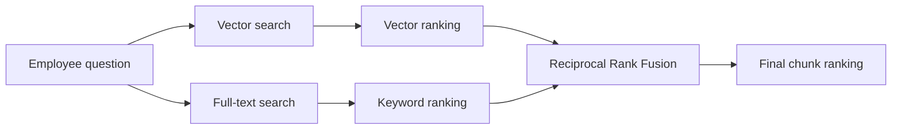
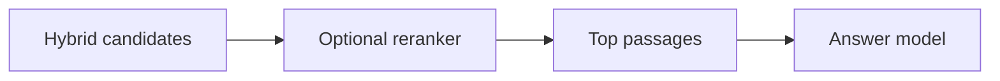

# Hybrid search and reranking

Hybrid search combines semantic retrieval with exact-word retrieval.
The lesson uses pgvector for meaning, PostgreSQL full-text search for words, and Reciprocal Rank Fusion to combine the two ranked lists.

## The retrieval path



The two searches return ranks, not comparable scores.
A cosine similarity and a full-text relevance score have different scales.
Adding the raw values would give one system accidental control over the result.

## Reciprocal Rank Fusion

For each result, RRF adds:

```text
1 / (60 + rank)
```

A chunk that ranks well in both lists receives two contributions.
A chunk that appears in only one list can still survive.
The smoothing value `60` reduces the effect of small rank changes near the top.

```text
vector ranks:   A, B, C
keyword ranks:  B, D, A

fused result:   B, A, D, C
```

## Run it

Complete the [database setup](postgres-and-pgvector.md), then run:

```bash
uv run python examples/lesson-06/hybrid_search.py \
  "Can I carry unused holiday into next year?"
```

Each result shows its keyword rank and vector rank.
`None` means that retrieval method did not include the chunk in its candidate list.

The `hybrid_search()` function calls [`keyword_search()`](../../examples/lesson-06/keyword_search.py) and [`vector_search()`](../../examples/lesson-06/vector_search.py) directly.
It converts their ordered results into ranks, then passes those two lists to `reciprocal_rank_fusion()`.
Every part of the composition is ordinary Python and there is no answer agent in this lesson.

## Where reranking fits

RRF is a rank-fusion method.
A separate reranker can score the fused candidates more carefully before they go to the answer model.



A reranker can improve relevance, but it adds latency, cost, and another model to evaluate.
Start with fused retrieval.
Add reranking only when evals show that the top candidates are often in the wrong order.

## Production checks

Measure retrieval before changing weights or adding models.
Useful evidence includes recall at a fixed candidate count, top-result accuracy, latency, and failure cases grouped by question type.
The best-looking result from one demo question is not enough to select a production strategy.
