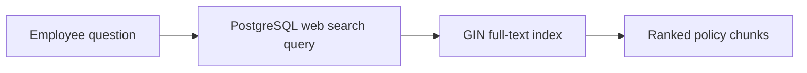

# How keyword search works

Keyword search retrieves chunks containing the words in a question.
It complements vector search when exact names, identifiers, acronyms, or rare terms matter.

## The retrieval path



PostgreSQL stores a generated `tsvector` for every chunk.
The GIN index makes matching that column efficient.

## The important SQL

[`step_05_keyword_search.py`](../../examples/lesson-06/step_05_keyword_search.py)
runs the equivalent of:

```sql
select
    d.title,
    c.content,
    ts_rank_cd(
        c.search_vector,
        websearch_to_tsquery('english', :question)
    ) as score
from lesson_06.support_document_chunks c
join lesson_06.support_documents d on d.id = c.document_id
where c.search_vector @@ websearch_to_tsquery('english', :question)
order by score desc
limit 5;
```

## Run it

Complete the [database setup](postgres-and-pgvector.md), then run:

```bash
uv run python examples/lesson-06/step_05_keyword_search.py \
  "Can I carry unused holiday into next year?"
```

Each result shows PostgreSQL's relevance score, policy title, chunk ID, and chunk text.

## What keyword search misses

Keyword search depends on overlapping terms.
It can miss a relevant policy when the question uses a paraphrase that the document never uses.
[Vector search](vector-search.md) handles meaning beyond exact words.
[Hybrid search](hybrid-search.md) combines both rankings.
