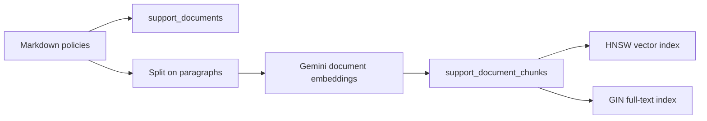

# Set up PostgreSQL and pgvector

Lesson 06 adds vector and full-text indexes to the same local `rag_lesson` database used in Lesson 05.
Its `lesson_06` schema keeps this teaching data separate from the complete-document example and the production application.

## What you will create

The raw SQL in
[`step_01_setup.sql`](../../examples/lesson-06/step_01_setup.sql) creates:

- `lesson_06.support_documents` for complete approved policies
- `lesson_06.support_document_chunks` for paragraph-sized chunks
- a GIN index for PostgreSQL full-text search
- an HNSW index for pgvector cosine search

## 1. Install pgvector

pgvector is a PostgreSQL extension, so it must be installed for the same local PostgreSQL version that runs your database.

On macOS with Homebrew PostgreSQL 17 or 18:

```bash
brew install pgvector
```

The Homebrew formula adds pgvector only to Homebrew PostgreSQL 17 and 18.
For an older Homebrew PostgreSQL version, Linux, Windows, Postgres.app, or a source installation, follow the [official pgvector installation guide](https://github.com/pgvector/pgvector#installation).

## 2. Configure Google Cloud

The examples use Vertex AI through Application Default Credentials.
No Gemini API key is required.

```bash
gcloud auth application-default login
gcloud auth application-default set-quota-project build-ai-systems-dev
```

Copy the example environment file and set the project:

```bash
cp examples/.env.sample examples/.env
```

```dotenv
GOOGLE_GENAI_USE_ENTERPRISE=TRUE
GOOGLE_CLOUD_PROJECT=build-ai-systems-dev
GOOGLE_CLOUD_LOCATION=global
```

You do not need to set `RAG_DATABASE_URL` for the normal local setup.
The examples default to `postgresql:///rag_lesson`, which uses your operating-system user and the local PostgreSQL socket.

## 3. Create the database

If you did not create it in Lesson 05, run:

```bash
createdb rag_lesson
```

If `rag_lesson` already exists, continue.

## 4. Apply the raw SQL

```bash
psql rag_lesson < examples/lesson-06/step_01_setup.sql
```

This enables pgvector in `rag_lesson` and creates the Lesson 06 schema, tables, and indexes.
It is safe to run again because the setup uses `if not exists`.

Inspect the schema:

```bash
psql rag_lesson -c '\d lesson_06.support_document_chunks'
```

## 5. Run the numbered examples

The setup SQL you applied above is Step 1.
The remaining filenames continue in the order you run them.

### Step 2: Chunk text

Run the pure text transformation before introducing the database or embedding model:

```bash
uv run python examples/lesson-06/step_02_chunk_text.py
```

The `chunk_text()` function splits one policy on paragraph boundaries and omits its title heading.

### Step 3: Populate PostgreSQL

```bash
uv run python examples/lesson-06/step_03_populate_database.py
```

The population command reads the canonical Markdown files in `policies/`.
It stores each whole document, splits it on paragraph boundaries, and asks `gemini-embedding-001` for a 768-dimensional embedding for each chunk.
Running it again replaces the lesson's documents and chunks with the current approved policies.

Inspect the data:

```bash
psql rag_lesson -c \
  'select document_id, count(*) from lesson_06.support_document_chunks group by document_id order by document_id;'
```

### Step 4: Vector search

```bash
uv run python examples/lesson-06/step_04_vector_search.py
```

### Step 5: Keyword search

```bash
uv run python examples/lesson-06/step_05_keyword_search.py
```

### Step 6: Hybrid search with RRF

```bash
uv run python examples/lesson-06/step_06_hybrid_search.py
```

## How the ingestion path works



Document embeddings use the `RETRIEVAL_DOCUMENT` task type.
Search questions use `RETRIEVAL_QUERY`.
That distinction gives the embedding model the correct role for each input.

## Troubleshooting

`connection refused` means the local PostgreSQL server is not running or your connection settings differ from the default.
Run `pg_isready` first.
Set `RAG_DATABASE_URL` in `examples/.env` if your server uses another user, host, port, or database.

`type "vector" does not exist` or `extension "vector" is not available` means pgvector is not installed for the PostgreSQL server you are using.
Install it for that PostgreSQL version, then run the setup SQL again.

An authentication or quota-project error means Application Default Credentials are missing or stale.
Run the two `gcloud auth application-default` commands again.

## Ask a coding agent to set this up

Copy this prompt into Codex or another coding agent from the repository root:

```text
Set up the Lesson 06 vector and hybrid search examples on my machine.

First inspect my operating system, PostgreSQL version, pg_config path, running server, and whether the vector extension is available.
Use my native local PostgreSQL installation, not Docker, and reuse the rag_lesson database from Lesson 05.
If pgvector is missing, identify the official install command for my PostgreSQL version and wait for my approval before installing it.
Do not delete or overwrite any existing database, role, schema, or configuration.
Apply examples/lesson-06/step_01_setup.sql, verify the vector extension and both indexes, then run the chunking, population, vector, keyword, and hybrid examples.
Use the Google Cloud settings in examples/.env without printing credentials.
Finish with the verification results and the commands I can use next time.
```
