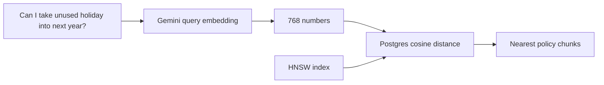

# How vector search works

Vector search retrieves chunks with similar meaning, even when the question and document use different words.
The example searches PostgreSQL with pgvector instead of calculating similarity in Python.

## The retrieval path



The population step has already converted each policy chunk into a vector.
At search time, the code embeds only the question and sends that vector to PostgreSQL.

## The important SQL

[`step_04_vector_search.py`](../../examples/lesson-06/step_04_vector_search.py)
runs the equivalent of:

```sql
select
    d.title,
    c.content,
    1 - (c.embedding <=> :query_embedding) as similarity
from lesson_06.support_document_chunks c
join lesson_06.support_documents d on d.id = c.document_id
order by c.embedding <=> :query_embedding
limit 5;
```

pgvector's `<=>` operator returns cosine distance.
Smaller distance is better, so the query orders ascending.
The displayed similarity is `1 - distance`, where a larger value is better.

## Run it

Complete the [database setup](postgres-and-pgvector.md), then run:

```bash
uv run python examples/lesson-06/step_04_vector_search.py \
  "Can I take unused holiday into next year?"
```

The annual leave chunk about carrying unused days should rank first.
The exact similarity values can change when the embedding model changes, so treat the ranking as the result, not a hard-coded score.

Try a paraphrase:

```bash
uv run python examples/lesson-06/step_04_vector_search.py \
  "What is the deadline for getting reimbursed?"
```

The expenses chunk about submitting a claim within 30 days should rank near the top even though the policy does not use the word `reimbursed`.

## Why chunks exist

Embedding a complete handbook produces one broad vector.
Smaller chunks make the matching passage easier to find and keep the later model context focused.

Chunk size is a retrieval decision, not a fixed rule.
Chunks that are too large mix several topics.
Chunks that are too small lose the surrounding meaning.
This lesson uses paragraphs because the policies are short and already structured that way.

## What vector search misses

Semantic similarity is not always enough.
An employee might search for an exact policy code, product name, or uncommon acronym.
Those exact words can matter more than broad meaning.
[Hybrid search](hybrid-search.md) adds keyword retrieval for that case.
